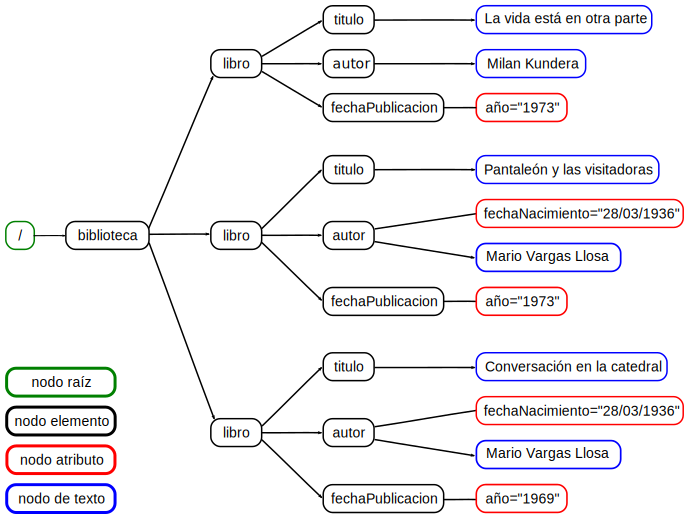

# XPath

## Tipos de nodos

Un documento XML puede representarse como un árbol dirigido, considerando por ejemplo los elementos como nodos y que un elemento es padre de los elementos que contiene. Pero en XPath no sólo los elementos son nodos, en realidad hay siete tipos de nodos:

* Raíz
* Elemento
* Atributo
* Texto
* Comentario
* Instrucción de procesamiento
* Espacio de nombres
* Entidad
* Sección CDATA

``` xml
<?xml version="1.0" encoding="UTF-8"?>
<biblioteca>
  <libro>
    <titulo>La vida está en otra parte</titulo>
    <autor>Milan Kundera</autor>
    <fechaPublicacion año="1973"/>
  </libro>
  <libro>
    <titulo>Pantaleón y las visitadoras</titulo>
    <autor fechaNacimiento="28/03/1936">Mario Vargas Llosa</autor>
    <fechaPublicacion año="1973"/>
  </libro>
  <libro>
    <titulo>Conversación en la catedral</titulo>
    <autor fechaNacimiento="28/03/1936">Mario Vargas Llosa</autor>
    <fechaPublicacion año="1969"/>
  </libro>
</biblioteca>
```


## Expresiones XPath

Una expresión XPath simple consta de 3 pasos de localización:

* Eje --> Indica con respecto al nodo contexto el conjunto de nodos sobre los cuales se evaluará el test de nodo.
* Test de nodo --> Sirve para, una vez identificado un conjunto de nodos con el eje adecuado, especificar exactamente que nodos de ese conjunto son los que queremos.
* Predicado --> Son condiciones que deben cumplir los nodos a seleccionar.

``` xslt
eje::test-nodo[predicado]
```
### Ejes

* self. El propio nodo contexto.
* child. Los hijos del nodo contexto.
* parent. El padre del nodo contexto.
* ancestor. Los antepasados del nodo contexto.
* ancestor-or-self. El nodo contexto y sus antepasados.
* descendant. Los descendientes del nodo contexto.
* descendant-or-self. El nodo contexto y sus descendientes.
* following. Los nodos siguientes al nodo contexto, sin descendientes.
* following-sibling. Los nodos del mismo nivel que siguen al nodo contexto.
* preceding. Los nodos anteriores al nodo contexto, sin antepasados.
* preceding-sibling. Los nodos del mismo nivel que preceden al nodo contexto.
* attribute. Los nodos atributo del nodo contexto.
* namespace. Los nodos de espacio de nombres del nodo contexto.

Si no se indica un eje explícitamente, este toma el valor de "child".

``` xslt
<!-- Sentencias equivalentes -->
/venta/cliente/@cod
/child::venta/child::cliente/attribute::cod
```

#### Ejemplos jodidillos:
```xml
<document id="1">
  <content>
    <html>
      <head>
      </head>
      <body>
        <div id="outer">
          <div id="inner">
            <ul>
              <li><a href="http://www.google.de/">Google</a>
                <ul>
                  <li><a href="http://earth.google.de/">Google Earth</a></li>
                  <li><a href="http://picasa.google.de/intl/de/">Picasa</a></li>
                </ul>
              </li> 
              <li><a href="http://www.heise.de/">Heise</a></li> 
              <li><a href="http://www.yahoo.de/">Yahoo</a></li> 
            </ul>
          </div>
        </div>
      </body>
    </html>
  </content>
</document>
```

```xslt
<!-- Coger el atributo id del elemento div antecesor más cercano al enlace a Google Earth -->
//a[contains(@href, "earth.google.")]/ancestor::div[1]/@id
```

```xml
<artist name="Robbie Williams">
  <cd name="Rudebox"> 
    <title>Rudebox</title>
    <title>Viva Life On Mars</title>
    <title>Lovelight (Lewis Taylor Cover)</title>
    <title>King Of The Bongo (Manu Chao Cover)</title>
    <title>Swing when you're winning</title>
    <title>Good Doctor</title>
  </cd> 
</artist>
```

```xslt
<!-- Calcular la posición del tema de Manu Chao dentro del cd -->
//title[contains(./text(), "Manu Chao")]/count(preceding-sibling::title) + 1
```

### Tests de nodo

Los test de nodo pueden ser:
* nombre_de_un_nodo --> Selecciona todos los nodos con el nombre indicado. 
* \* --> Selecciona todos los elementos y atributos.
* node() --> Selecciona todos los nodos (de cualquier tipo).
* text() --> Selecciona los nodos de texto.
* comment() --> Selecciona los nodos de comentario.
* processing-instructions() --> Selecciona los nodos de procesamiento de instrucciones.