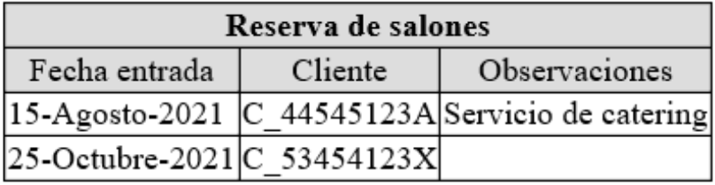

# XSLT
XSLT (Transformaciones XSL) es un lenguaje de programación declarativo que permite generar documentos a partir de documentos XML, como ilustra la imagen siguiente:


XSLT se emplea como una hoja de estilos aplicada a un documento XML. Esta hoja define una colección de plantillas (template rules). Cada plantilla establece cómo se transforma un determinado elemento (definido mediante expresiones XPath). La transformación del documento se realiza de la siguiente manera:

* El procesador analiza el documento y construye el árbol del documento.
* El procesador recorre el árbol del documento desde el nodo raíz.
* En cada nodo recorrido, el procesador aplica o no alguna plantilla:
	* Si a un nodo no se le puede aplicar ninguna plantilla, su contenido se incluye en el documento final (el texto del nodo, no el de los nodos descendientes). A continuación, el procesador recorre sus nodos hijos.
	* Si a un nodo se le puede aplicar una plantilla, se aplica la plantilla. La plantilla puede generar texto que se incluye en el documento final. En principio, el procesador no recorre sus nodos hijos, salvo que la plantilla indique al procesador que sí que deben recorrerse los nodos hijos.
* Cuando el procesador ha recorrido el árbol, se ha terminado la transformación.

## Enlazar XML con hoja de estilos XSLT

``` xml title="ejemplo.xml"
<?xml version="1.0" encoding="UTF-8"?>
<?xml-stylesheet type="text/xsl" href="ejemplo.xsl"?>
<catalog>
  <cd>
    <title>Empire Burlesque</title>
    <artist>Bob Dylan</artist>
  </cd>
  <cd>
    <title>Hide your heart</title>
    <artist>Bonnie Tyler</artist>
  </cd>
</catalog>
```

```xml title="ejemplo.xsl"
<?xml version="1.0" encoding="UTF-8"?>
<xsl:stylesheet version="1.0" xmlns:xsl="http://www.w3.org/1999/XSL/Transform">
<xsl:template match="/">
  <html>
    <body>
      <h2>My CD Collection</h2>
      <table border="1">
        <tr bgcolor="#9acd32">
          <th>Title</th>
          <th>Artist</th>
        </tr>
        <xsl:for-each select="catalog/cd">
          <xsl:sort select="artist"/>
          <tr>
            <td><xsl:value-of select="title"/></td>
            <td><xsl:value-of select="artist"/></td>
          </tr>
        </xsl:for-each>
      </table>
    </body>
  </html>
</xsl:template>
```

## Formato del documento de salida: **`<xsl:output>`**

La instrucción **`<xsl:output>`** define el formato del documento de salida. Aunque ofrece multitud de atributos para su configuración, nos centraremos en 2:

* `indent` → Puede tomar los valores "yes" o "no" e indica si la salida estará indentada conforme a su jerarquía.
* `method` → Define el formato de salida. Puede tomar los siguiente valores: `xml|html|text|name`. Aunque lo habitual será XML o HTML.

```xml title="ejemplo.xsl"
<?xml version="1.0" encoding="UTF-8"?>
<xsl:stylesheet version="1.0" xmlns:xsl="http://www.w3.org/1999/XSL/Transform">
<xsl:output indent="yes" method="html"/>
<xsl:template match="/">
  <html>
    <body>
      <h2>My CD Collection</h2>
      <table border="1">
        <tr bgcolor="#9acd32">
          <th>Title</th>
          <th>Artist</th>
        </tr>
        <xsl:for-each select="catalog/cd">
          <xsl:sort select="artist"/>
          <tr>
            <td><xsl:value-of select="title"/></td>
            <td><xsl:value-of select="artist"/></td>
          </tr>
        </xsl:for-each>
      </table>
    </body>
  </html>
</xsl:template>
```

## La instrucción **`<xsl:value-of>`**

Extrae el contenido del nodo seleccionado mediante la expresión XPath utilizada en el atributo select.

```xml title="biblioteca.xml"
<?xml version="1.0" encoding="UTF-8"?>
<?xml-stylesheet type="text/xsl" href="biblioteca.xsl"?>
<biblioteca>
  <libro>
    <titulo>La vida está en otra parte</titulo>
    <autor>Milan Kundera</autor>
    <fechaPublicacion año="1973"/>
  </libro>
  <libro>
    <titulo>Pantaleón y las visitadoras</titulo>
    <autor fechaNacimiento="28/03/1936">Mario Vargas Llosa</autor>
    <fechaPublicacion año="1973"/>
  </libro>
  <libro>
    <titulo>Conversación en la catedral</titulo>
    <autor fechaNacimiento="28/03/1936">Mario Vargas Llosa</autor>
    <fechaPublicacion año="1969"/>
  </libro>
</biblioteca>
```
``` xml title="biblioteca.xsl"
<?xml version="1.0" encoding="UTF-8"?>
<xsl:stylesheet version="1.0" xmlns:xsl="http://www.w3.org/1999/XSL/Transform">

  <xsl:template match="fechaPublicacion">
     <xsl:value-of select="@año"/>
  </xsl:template>

</xsl:stylesheet>

</xsl:stylesheet>
```
``` xml title="resultado.xml"
<?xml version="1.0" encoding="UTF-8"?>

    La vida está en otra parte
    Milan Kundera
    1973

    Pantaleón y las visitadoras
    Mario Vargas Llosa
    1973

    Conversación en la catedral
    Mario Vargas Llosa
    1969
```
> Además de los valores seleccionados del atributo año, el resultado incluye el contenido de los elementos título y autor (y el salto de línea del raíz), pues no hay template definido para ellos, pero sí son procesados (son hermanos de fechaPublicacion).


## Aplicar reglas a subnodos: la instrucción **`<xsl:apply-templates>`**

La instrucción **`<xsl:apply-templates>`** hace que se apliquen a los subelementos las reglas que les sean aplicables.

```xml title="biblioteca.xml"
<?xml version="1.0" encoding="UTF-8"?>
<?xml-stylesheet type="text/xsl" href="biblioteca.xsl"?>
<biblioteca>
  <libro>
    <titulo>La vida está en otra parte</titulo>
    <autor>Milan Kundera</autor>
    <fechaPublicacion año="1973"/>
  </libro>
  <libro>
    <titulo>Pantaleón y las visitadoras</titulo>
    <autor fechaNacimiento="28/03/1936">Mario Vargas Llosa</autor>
    <fechaPublicacion año="1973"/>
  </libro>
  <libro>
    <titulo>Conversación en la catedral</titulo>
    <autor fechaNacimiento="28/03/1936">Mario Vargas Llosa</autor>
    <fechaPublicacion año="1969"/>
  </libro>
</biblioteca>
```

``` xml title="biblioteca.xsl"
<?xml version="1.0" encoding="UTF-8"?>
<xsl:stylesheet version="1.0" xmlns:xsl="http://www.w3.org/1999/XSL/Transform">

  <xsl:template match="/">
    <html>
      <h1>Autores</h1>
      <xsl:apply-templates />
    </html>
  </xsl:template>

  <xsl:template match="libro">
     <p><xsl:value-of select="autor"/></p>
  </xsl:template>

</xsl:stylesheet>
```
``` html title="resultado.html"
<?xml version="1.0" encoding="UTF-8"?>
<html><h1>Autores</h1>
  <p>Milan Kundera</p>
  <p>Mario Vargas Llosa</p>
  <p>Mario Vargas Llosa</p>
</html>
```
> La primera plantilla sustituye el elemento raíz (y todos sus subelementos) por las etiquetas `<html>` y `<h1>`, pero además aplica a los subelementos las plantillas que les son aplicables. En este caso, sólo hay una plantilla para los elementos `<libro>` que generan los párrafos.


## Generación de elementos: **`<xsl:element>`**

Dentro de un patrón podemos emplear **`<xsl:element>`** para crear un nuevo elemento en el documento de salida. Es obligatorio indicar el nombre del nuevo elemento mediante el atributo `name`.

``` xml title="element.xsl"
<?xml version="1.0" encoding="utf-8"?>
<xsl:stylesheet version="1.0" xmlns:xsl="http://www.w3.org/1999/XSL/Transform">
  <xsl:template match="/ciclo">
    <xsl:element name="{concat(name(), '_asir')}" />
  </xsl:template>
</xsl:stylesheet>
```
> Este ejemplo reemplazaría el elemento ciclo por uno con el nombre `ciclo_asir`.


## Generación de atributos: **`<xsl:attribute>`**

Cuando creamos un nuevo elemento en el documento de salida empleando **`<xsl:element>`**, también podemos especificar sus atributos. Simplemente tendremos que añadir como hijos de este tantos elementos **`<xsl:attribute>`** como necesitemos, indicando en cada uno de ellos su nombre con el atributo `name`. Su valor será el texto que contenga.

``` xml title="attribute.xsl"
<?xml version="1.0" encoding="utf-8"?>
<xsl:stylesheet version="1.0" xmlns:xsl="http://www.w3.org/1999/XSL/Transform">
  <xsl:template match="/módulo/profesor">
    <xsl:element name="{name()}">
      <xsl:attribute name="nombre">
        <xsl:value-of select="text()" />
      </xsl:attribute>
    </xsl:element>
  </xsl:template>
</xsl:stylesheet>
```

## Bucles
### Recorrido de nodos: **`<xsl:for-each>`**

El elemento **`<xsl:for-each>`** permite procesar todos los elementos XML de un conjunto de nodos específico.

```xml title="biblioteca.xml"
<?xml version="1.0" encoding="UTF-8"?>
<?xml-stylesheet type="text/xsl" href="biblioteca.xsl"?>
<biblioteca>
  <libro>
    <titulo>La vida está en otra parte</titulo>
    <autor>Milan Kundera</autor>
    <fechaPublicacion año="1973"/>
  </libro>
  <libro>
    <titulo>Pantaleón y las visitadoras</titulo>
    <autor fechaNacimiento="28/03/1936">Mario Vargas Llosa</autor>
    <fechaPublicacion año="1973"/>
  </libro>
  <libro>
    <titulo>Conversación en la catedral</titulo>
    <autor fechaNacimiento="28/03/1936">Mario Vargas Llosa</autor>
    <fechaPublicacion año="1969"/>
  </libro>
</biblioteca>
```

``` xml title="for-each.xsl"
<?xml version="1.0" encoding="UTF-8"?>
<xsl:stylesheet version="1.0" xmlns:xsl="http://www.w3.org/1999/XSL/Transform">
<xsl:output indent="yes" method="html"/>

<xsl:template match="/">
  <html>
    <body>
      <h2>Tabla de libros</h2>
      <table border="1">
        <tr bgcolor="#9acd32">
          <th>Título</th>
          <th>Autor</th>
        </tr>
        <xsl:for-each select="biblioteca/libro">
          <tr>
            <td><xsl:value-of select="titulo"/></td>
            <td><xsl:value-of select="autor"/></td>
          </tr>
        </xsl:for-each>
      </table>
    </body>
  </html>
</xsl:template>

</xsl:stylesheet>
```

### Ordenación: **`<xsl:sort>`**

El elemento **`<xsl:sort>`** permite ordenar la salida generada por un **`<xsl:for-each>`** en base a algún campo de los elementos procesados. Los atributos que permiten su configuración son:

* `order` → Indica si se desea ordenación ascendente (`ascending`) o descendente (`descending`).
* `data-type` → Indica si se desea una ordenación alfabética (`text`) o numérica (`number`).
* `select` → Indica el campo en base al cuál se ordenará.

``` xml title="sort.xsl"
<?xml version="1.0" encoding="UTF-8"?>
<xsl:stylesheet version="1.0" xmlns:xsl="http://www.w3.org/1999/XSL/Transform">
<xsl:output indent="yes" method="html"/>

<xsl:template match="/">
  <html>
    <body>
      <h2>Tabla de libros</h2>
      <table border="1">
        <tr bgcolor="#9acd32">
          <th>Título</th>
          <th>Autor</th>
        </tr>
        <xsl:for-each select="biblioteca/libro">
          <xsl:sort order="ascending" data-type="number" select="fechaPublicacion/@año"/>
          <tr>
            <td><xsl:value-of select="titulo"/></td>
            <td><xsl:value-of select="autor"/></td>
          </tr>
        </xsl:for-each>
      </table>
    </body>
  </html>
</xsl:template>

</xsl:stylesheet>
```

## Condiciones

### **`<xsl:if>`**
El elemento **`<xsl:if>`** nos permite crear condiciones. El elemento consta de un atributo obligatorio test, cuyo valor contiene la expresión que se evaluará en el documento de origen. A diferencia de otros lenguajes de programación, en XSLT no se da ninguna conexión entre IF y ELSE.

```xml title="biblioteca.xml"
<?xml version="1.0" encoding="UTF-8"?>
<?xml-stylesheet type="text/xsl" href="biblioteca.xsl"?>
<biblioteca>
  <libro idioma="es">
    <titulo>La vida está en otra parte</titulo>
    <autor>Milan Kundera</autor>
    <fechaPublicacion año="1973"/>
  </libro>
  <libro idioma="en">
    <titulo>The Tragedy of Hamlet, Prince of Denmark</titulo>
    <autor fechaNacimiento="23/04/1564">William Shakespeare</autor>
    <fechaPublicacion año="1601"/>
  </libro>
  <libro idioma="es">
    <titulo>Conversación en la catedral</titulo>
    <autor fechaNacimiento="28/03/1936">Mario Vargas Llosa</autor>
    <fechaPublicacion año="1969"/>
  </libro>
</biblioteca>
```

``` xml title="if.xsl"
<?xml version="1.0" encoding="UTF-8"?>
<xsl:stylesheet version="1.0" xmlns:xsl="http://www.w3.org/1999/XSL/Transform">
<xsl:output indent="yes" method="html"/>

<xsl:template match="/">
  <html>
    <body>
      <h2>Tabla de libros</h2>
      <table border="1">
        <tr bgcolor="#9acd32">
          <th>Título</th>
          <th>Autor</th>
          <th>Idioma</th>
        </tr>
        <xsl:for-each select="biblioteca/libro">
          <xsl:sort order="ascending" data-type="number" select="fechaPublicacion/@año"/>
          <tr>
            <td><xsl:value-of select="titulo"/></td>
            <td><xsl:value-of select="autor"/></td>
            <xsl:if test="@idioma='es'"><td>Español</td></xsl:if>
            <xsl:if test="@idioma='en'"><td>Inglés</td></xsl:if>
            <xsl:if test="@idioma='de'"><td>Alemán</td></xsl:if>
          </tr>
        </xsl:for-each>
      </table>
    </body>
  </html>
</xsl:template>

</xsl:stylesheet>
```

### **`<xsl:choose>`**

El elemento **`<xsl:choose>`** con sus elementos secundarios **`<xsl:when>`** y **`<xsl:otherwise>`** se corresponde con la estructura condicional `switch-case` en otros lenguajes de programación.

Esta estructura permite establecer varias condiciones. Además, se puede fijar un valor, que se asignará en caso de que ninguna de éstas se cumpla. La estructura debe comenzar con el elemento **`<xsl:choose>`**. El elemento puede contener tantos elementos secundarios **`<xsl:when>`** como se desee y un único elemento **`<xsl:otherwise>`** final.

``` xml title="choose.xsl"
<?xml version="1.0" encoding="UTF-8"?>
<xsl:stylesheet version="1.0" xmlns:xsl="http://www.w3.org/1999/XSL/Transform">
<xsl:output indent="yes" method="html"/>

<xsl:template match="/">
  <html>
    <body>
      <h2>Tabla de libros</h2>
      <table border="1">
        <tr bgcolor="#9acd32">
          <th>Título</th>
          <th>Autor</th>
          <th>Idioma</th>
        </tr>
        <xsl:for-each select="biblioteca/libro">
          <xsl:sort order="ascending" data-type="number" select="fechaPublicacion/@año"/>
          <tr>
            <td><xsl:value-of select="titulo"/></td>
            <td><xsl:value-of select="autor"/></td>
            <xsl:choose>
                  <xsl:when test="@idioma='es'"><td>Español</td></xsl:when>
                  <xsl:when test="@idioma='en'"><td>Inglés</td></xsl:when>
                  <xsl:when test="@idioma='de'"><td>Alemán</td></xsl:when>
                  <xsl:otherwise><td>Otro</td></xsl:otherwise>
             </xsl:choose>
          </tr>
        </xsl:for-each>
      </table>
    </body>
  </html>
</xsl:template>

</xsl:stylesheet>
```

## Ejercicios de exámen resueltos

### Galicia 2021

Tomando como base o seguinte documento XML:

``` xml title="reservas.xml" linenums="1"
--8<-- "./data/marcas/xsd/reservas.xml"
```

* Xere como saída das transformacións XSLT un documento HTML que conteña unha táboa como a seguinte. Observe que as reservas están ordenadas por mes. O texto das cabeceiras debe estar centrado. O color de fondo das celas sombreadas é #ddd




``` xml title="reservas.xsl" linenums="1"
--8<-- "./data/marcas/xslt/reservas.xsl"
```

### Cantabria 2018

Dado el documento XML Rusia2018.xml con algunos de los equipos y partidos de futbol jugados, se solicita la escritura del documento Rusia.xsl que realice la transformación del mismo en otro XML, resultados.xml, donde se puedan ver los resultados de los partidos tal como se muestra en la imagen. Explicar qué procesos son necesarios para realizar dicha transformación. Se debe utilizar la version 1.0 y el espacio de nombres xsl de http://www.w3.org/1999/XSL/Transform y codificación UTF-8.

``` xml title="Rusia2018.xml" linenums="1"
--8<-- "./data/marcas/xslt/Rusia2018.xml"
```

``` xml title="resultados.xml" linenums="1"
--8<-- "./data/marcas/xslt/resultados.xml"
```

Solución:

``` xml title="Rusia.xsl" linenums="1"
--8<-- "./data/marcas/xslt/Rusia.xsl"
```