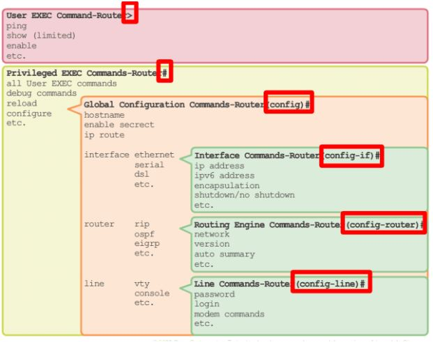
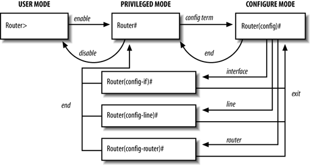

# Modos de navegación en IOS

* **Modo EXEC del usuario** --> Modo de trabajo limitado a operaciones básicas.
* **Modo EXEC privilegiado** --> Permite la ejecución de todos los comandos de control, así como de comandos de configuración y administración.
* **Modos de configuración**:
	* *Global* --> Permite la configuración global del router.
	* *Interfaz* --> Permite la configuración de las interfaces del router.
	* *Router* --> Permite la configuración del enrutado dinámico.
	* *Línea* -->  Permite la configuración de las líneas de conexión al router.




# Acceso remoto

## Configuración de SVI en switch para acceso remoto

Para poder conectarnos de forma remota con un switch, será necesario configurar previamente una SVI de gestión en el switch para acceder a través de una IP asociada a la misma. Necesitamos la gateway si el switch tiene que poder ser administrado desde redes no conectadas directamente. En IPv6 ya coge la gateway automáticamente de los RA.

Si queremos asignarle IPv6 al Switch primero tenemos que activar la doble pila y reiniciarlo (no viene por defecto):

``` bash
! Activar doble pila en Switch
S1(config)# sdm prefer dual-ipv4-and-ipv6 default
S1(config)# end
S1# copy running-config startup-config
S1# reload
```

``` bash
S1# configure terminal
S1(config)# interface vlan 1
S1(config-if)# ip address 172.17.99.11 255.255.255.0
S1(config-if) # ipv6 address 2001:db8:acad:99::1/64
S1(config-if)# no shutdown
S1(config-if)# exit
S1(config)# ip default-gateway 172.17.99.1
S1(config-if)# end
S1# copy running-config startup-config
```

## Acceso vía telnet en router o switch

```bash
! Poner contraseña al modo privilegiado (opcional):
S1(config)# enable secret contraseña123
! Creación usuario local con máximo privilegio:
S1(config)# username usuario1 privilege 15 secret contraseña321
! Configurar línea de consola para acceder con usuarios locales:
S1(config)# line console 0
S1(config-line)#login local
! Configurar líneas de acceso remoto para acceder con usuarios locales por telnet:
S1(config)#line vty 0 15
S1(config-line)#login local
S1(config-line)#transport input telnet
```

En lugar de acceder con un usuario local, podemos simplemente configurar una contraseña para las líneas vty y loguearnos por telnet con ella. En este caso es importante activar el cifrado de contraseñas para que no sean directamente visibles:
```bash
S1(config)# line console 0
S1(config-line)# password contraseña123
S1(config-line)# login
S1(config-line)# exit
S1(config)# service password-encryption
```

## Acceso vía SSH en router o switch

```bash
! Configurar líneas de acceso remoto para acceder con usuarios locales por ssh v2 con clave de 2048 bits:
Router(config)#hostname R1
R1(config)#ip domain-name dominio.com
R1(config)#crypto key generate rsa
R1(config)# 2048
R1(config)#ip ssh version 2
R1(config)#line vty 0 4
R1(config-line)#login local
R1(config-line)#transport input ssh
```
> Antes de habilitar el SSH es necesario definir un hostname, un nombre de dominio y generar un par de claves RSA.