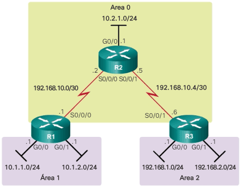
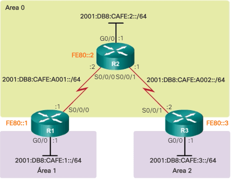

# Enrutamiento

## Enrutamiento estático
### Definición de una ruta estática en IPv4:

```bash
Router(config)# ip route [red-destino] [máscara-destino] [ip-siguiente-salto | interfaz-salida] (distancia) (permanent)
```
> * El siguiente salto puede ser una IP, una interfaz de salida, sin embargo, la interfaz de salida solo se debe indicar en el caso de enlaces punto a punto. En el caso de emplear una interfaz de salida la ruta se resuelve en una única búsqueda, mientras que si empleamos IP de siguiente salto necesitamos una búsqueda adicional para resolver la interfaz de salida para la IP especificada.
> * `distancia` → Distancia administrativa (0~255), cuanto mayor, peor es la ruta.
> * Es posible indicar como siguiente salto una interfaz de salida seguida por una IP de siguiente salto, es lo que se denomina como rutas estáticas completamente definidas.
> * `permanent` → Indica que la ruta no debe ser eliminada aunque la interfaz de salida deje de estar activa.

Para que una ruta sea agregada a la tabla de enrutamiento debe cumplir dos cosas:

* Para el ip route que usa la interfaz de salida del router, ésta interfaz debe esta en estado up/up.
* Para el ip route que usa la IP del next-hop del siguiente router, el router local debe tener una ruta para alcanzar la dirección del next-hop.

El proceso seguido por el router para construir su tabla de rutas es:

* Se introducen las rutas de las redes directamente conectadas (una para la IP de la interfaz y otra para la red).
* Se introducen las rutas estáticas en la tabla siempre que cumplan las condiciones anteriores.
* Se introducen las rutas aprendidas por protocolos dinámicos (RIP, OSPF...).
* En caso de empate (2 rutas igual de específicas hacia el mismo destino), únicamente se ingresa la ruta con menor distancia administrativa.
> Cabe destacar que este proceso es dinámico, por lo que es habitual disponer de rutas de backup que ingresarán en la tabla en caso de que la de menor distancia quede inaccesible.

Una vez construída la tabla de rutas puede darse el caso de que varias rutas matcheen con el paquete que estamos enrutando. En este caso **el router elegirá la más específica**, esto es, la de mayor prefijo.

### Ejemplo de ruta estática en IPv4:
```bash
R1(config)# ip route 192.168.10.0 255.255.255.0 10.10.10.2
```

### Ejemplo de ruta por defecto en IPv4:
```bash
Router(config)# ip route 0.0.0.0 0.0.0.0 Serial 0
```
> Cabe destacar que esta ruta matchea con cualquier destino, pero su prefijo es el más largo posible (/32), por lo que únicamente se aplicará si no se encuentra otra ruta más específica.


### Definición de una ruta estática en IPv6:

```bash
Router(config)# ipv6 unicast-routing
Router(config)# ipv6 route [red-destino]/[tamaño-prefijo-destino] [ipv6-siguiente-salto | interfaz-salida] (distance [distancia])
```
> El funcionamiento es el mismo que en IPv4 y también se puede especificar interfaz de salida e IPv6 de siguiente salto (en ese orden) para rutas completamente definidas.

### Ejemplo de ruta estática en IPv6:
```bash
R1(config)# ipv6 route 2001:DB8:ACAD:2::/64 s0/0/0
```

### Ejemplo de ruta por defecto en IPv6:
```bash
Router(config)# ip route ::/0 2001:db8:c::9f:35
```

### Distancias administrativas predeterminadas:
| Tipo de ruta | Distancia por defecto |
| ----------- | --- |
| Interfaz o conectada | 0 |
| Estática | 1 |
| EIGRP | 90 |
| OSPF | 110 |
| IS-IS | 115 |
| RIP | 120 |
| EIGRP externo | 170 |
| Inalcanzable | 255 |

> Es habitual configurar lo que se denomina como rutas estáticas flotantes, las cuales especifican una distancia superior a las aprendidas por protocolos dinámicos como 210, con lo cual sólo se emplearán si no descubrimos una mejor hacia dicho destino.


## Enrutamiento dinámico

### RIP

#### Configuración básica de RIP en IPv4

```bash
Router(config)# router rip
Router(config-router)# network 192.168.1.0 
Router(config-router)# network 200.200.1.0
Router(config-router)# version 2
Router(config-router)# no auto-summary
Router(config-router)# passive-interface Fa0/0
Router(config-router)# redistribute static
```
> * Debemos anunciar con el comando `network` todas las redes directamente conectadas que queramos anunciar además de **las redes que nos conectan con los demás routers RIP**.
> * La versión 2 de RIP trabaja con redes sin clase a diferencia de la 1 que asume redes con clase y no propaga máscaras.
> * El comando `no auto-summary` evita que RIP sumarice subredes en redes con clase a la hora de publicar rutas en límites de redes principales (por interfaces configuradas con redes con clase).
> * Por ejemplo, un router con 2 subredes configuradas: 172.16.8.0/24 y 172.16.4.0/24 de clase B y una subred 10.2.0.0/16 de clase A. Cuando `auto-summary` esté habilitado, el router anunciará solo la red sumarizada con clase: 172.16.0.0/16 para las subredes de clase B a través de su interfaz de clase A, pero podemos forzarle a anunciar ambas subredes con el comando `no auto-summary`.
> * El comando `passive-interface` indica las interfaces por las que no se difundirá tráfico de control RIP (habitualmente las de las redes LAN).
> * El comando `redistribute` se emplea para que RIP redistribuya rutas aprendidas por otros medios como estáticas (`static`), OSPF (`ospf`)...

#### Configuración básica de RIP en IPv6

```bash
Router(config)# ipv6 unicast-routing
Router(config)# ipv6 router rip proceso-rip
Router(config-router)# exit
Router(config)# interface FastEthernet0/0
Router(config-if)# ipv6 address 2001:DB8::/64 eui-64
Router(config-if)# ipv6 rip proceso-rip enable
```
> * Debemos activar proceso en todas las interfaces donde se encuentren las redes que queramos publicar y en las que comunican con otros routers.

### OSPF

#### Configuración básica de OSPF en IPv4

```bash
Router(config)# router ospf 1
Router(config-router)# router-id 1.1.1.1
Router(config-router)# network 192.168.1.0 0.0.0.255 area 0
Router(config-router)# network 200.200.1.0 0.0.255.255 area 0
Router(config-router)# passive-interface Fa0/0
```

#### Configuración de OSPF multiárea



* Configuración de R1:
```bash
R1(config)# router ospf 10
R1(config-router)# router-id 1.1.1.1
R1(config-router)# network 10.1.1.1 0.0.0.0 area 1
R1(config-router)# network 10.1.2.1 0.0.0.0 area 1
R1(config-router)# network 192.168.10.1 0.0.0.0 area 0
R1(config-router)# end
R1#
```

* Configuración de R2:
```bash
R2(config)# router ospf 10
R2(config-router)# router-id 2.2.2.2
R2(config-router)# network 192.168.10.0 0.0.0.3 area 0
R2(config-router)# network 192.168.10.4 0.0.0.3 area 0
R2(config-router)# network 10.2.1.0 0.0.0.255 area 0
R2(config-router)# end
R2#
```
* Configuración de R3:
```bash
R3(config)# router ospf 10
R3(config-router)# router-id 3.3.3.3
R3(config-router)# network 192.168.10.6 0.0.0.0 area 0
R3(config-router)# network 192.168.1.1 0.0.0.0 area 2
R3(config-router)# network 192.168.2.1 0.0.0.0 area 2
R3(config-router)# end
```

#### Configuración de OSPF multiárea en IPv6: OSPFv3



* Configuración de R1:
```bash
R1(config)# ipv6 router ospf 10
R1(config-rtr)# router-id 1.1.1.1
R1(config-rtr)# exit
R1(config)# interface GigabitEthernet 0/0
R1(config-if)# ipv6 ospf 10 area 1
R1(config-if)# 
R1(config-if)# interface Serial0/0/0
R1(config-if)# ipv6 ospf 10 area 0
R1(config-if)# end
R1#
```

* Configuración de R2:
```bash
R2(config)# ipv6 router ospf 10
R2(config-rtr)# router-id 2.2.2.2
R2(config-rtr)# exit
R2(config)# interfaz g0/0
R2(config-if)# ipv6 ospf 10 area 0
R2(config-if)# interfaz S0/0/0
R2(config-if)# ipv6 ospf 10 area 0
R2(config-if)# interfaz S0/0/1
R2(config-if)# ipv6 ospf 10 area 0
R2(config-if)# end
```

* Configuración de R2:
```bash
R3(config)# ipv6 router ospf 10
R3(config-rtr)# router-id 3.3.3.3
R3(config-rtr)# exit
R3(config)# interfaz g0/0
R3(config-if)# ipv6 ospf 10 area 2
R3(config-if)# interfaz S0/0/1
R3(config-if)# ipv6 ospf 10 area 0
R3(config-if)# end
```

#### Sumarización de rutas en OSPF

* En OSPFv2:
```bash
R1(config)# router ospf 10
R1(config-router)# area 1 range 10.1.0.0 255.255.252.0
R1(config-router)#
```
> * Con esta configuración se resumen las dos rutas internas del área 1 en una ruta resumida interárea OSPF en el R1. La ruta resumida 10.1.0.0/22 resume cuatro direcciones de red: de la 10.1.0.0/24 a la 10.1.3.0/24.
> * Esto se realizar en los routers ABR (frontera entre varias áreas) para optimizar el enrutamiento.

* En OSPFv3:
```bash
device# configure terminal
device(config)# ipv6 router ospf
device(config-ospf6-router)# area 3 range 2001:db8:8::/45 advertise
```