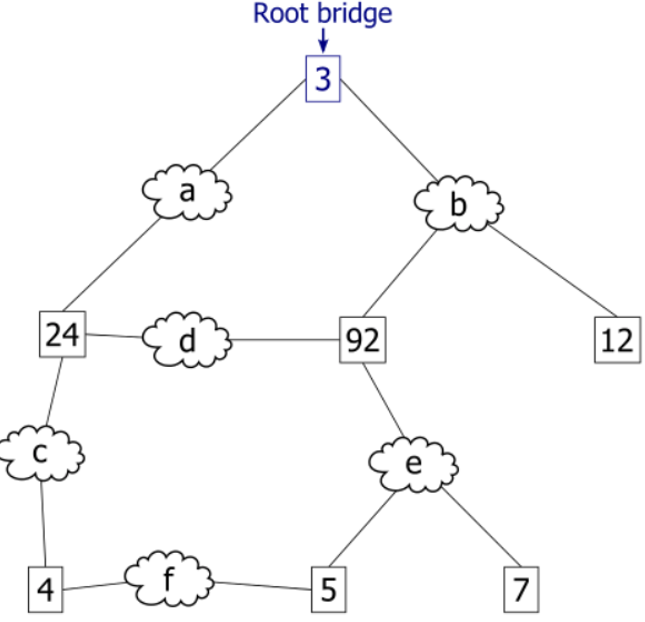
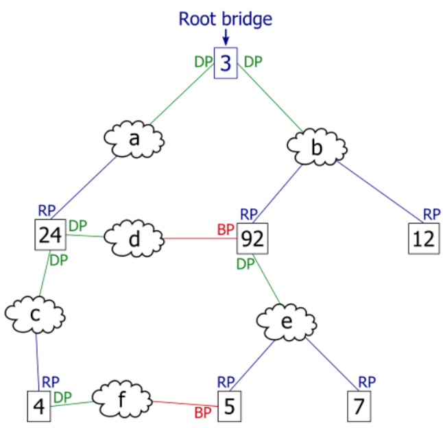

# STP

STP es un protocolo de red de prevención de bucles que permite redundancia mientras crea una topología de capa 2 sin bucles. El principal objetivo es evitar tormentas de broadcast (en capa 2 no hay TTL), y para ello crea una topología lógica en árbol para cada VLAN bloqueando lógicamente determinados puertos de los switches.

Es un protocolo dinámico capaz de reaccionar a cambios en la red, reactivando puertos bloqueados en caso de perder conectividad por otros enlaces inicialmente activos.

Para generar esta topología sin bucles STP realiza 4 pasos:

1. Elige el puente raíz.
2. Selecciona los puertos raíz.
3. Elige los puertos designados.
4. Selecciona los puertos alternativos (bloqueados).

Para ello, los switches intercambian BPDUs para compartir información sobre ellos mismos y sus conexiones. Cada BPDU contiene una ID de puente (BID) que identifica qué switch envió la BPDU. El BID es una combinación de un valor de prioridad, la dirección MAC del switch y un ID de sistema extendido.

* **Prioridad de puente**: el valor de prioridad predeterminado para todos los switch Cisco es 32768. El rango va de 0 a 61440 con saltos de 4096. Es preferible una prioridad de puente más baja. La prioridad de puente 0 prevalece sobre el resto de las prioridades de puente.

* **ID del sistema extendido**: identifica la VLAN para esta BPDU (un switch puede tener diferentes prioridades para cada VLAN).

* **Dirección MAC**: cuando dos switches se configuran con la misma prioridad y tienen el mismo ID de sistema extendido, el switch que tiene la dirección MAC con el valor más bajo tendrá el BID más bajo.

## Proceso STP detallado

1. **Elección del puente raíz (root bridge)**: Esta elección se realiza escogiendo el puente con menor BID (Bridge ID). El puente raíz será el nodo raíz de la topología de árbol:



2. **Elección de los puertos raíz**: En todos los puentes que no son el raíz, se utiliza el algoritmo de árbol expandido (STA) para escoger como puerto raíz al que tenga un menor coste de conexión hasta el puerto raíz. Este algoritmo tiene en cuenta los costes de aquellos puertos que forman los enlaces que hay que atravesar, determinados por la velocidad de los mismos.
> El coste de un puerto puede configurarse manualmente para alterar la elección del puerto raíz, pero el estándar STP define los siguientes valores:
> * 10 Gbps --> 2
> * 1 Gbps --> 4
> * 100 Mbps --> 19
> * 10 Mbps --> 100

> Los costes definidos en la versión RSTP son:
> * 10 Gbps --> 2000
> * 1 Gbps --> 20000
> * 100 Mbps --> 200000
> * 10 Mbps --> 2000000


3. **Elección de los puertos designados**: En el puente raíz, todos los puertos son puertos designados. El resto de puentes, establecerán un puerto designado en cada segmento entre 2 switches. El puerto designado será aquel que tenga un menor coste de conexión con el puente raíz (o el puerto del puente que tenga menor BID en caso de que los puertos de ambos extremos del enlace tengan el mismo coste).


4. **Bloqueo de puertos**: Los puertos que no están establecidos como puertos raíz ni designados se establecen como puertos bloqueados o puertos alternativos (o de backup). Estos puertos ni envían ni reciben tráfico para prevenir la formación de bucles, a excepción de las tramas BPDU del propio protocolo STP.



5. **Reconfiguración de STP**: En caso de caída de un enlace de la red, se aplica de nuevo el algoritmo STA para determinar los nuevos puertos raíz, designados y alternativos. Esto provocará que se activen enlaces hasta ahora bloqueados, para mantener la conectividad en la red.


## Comandos STP

* Activar STP en un switch:
```bash
S1(config)# spanning-tree
S1(config)# spanning-tree mode rapid-pvst
```
> Dependiendo de la versión del switch los modos admitidos de STP son diferentes, pero los más comunes son: `pvst` y `rapid-pvst` . RPVSTP es la opción por defecto y la recomendada, pues goza de una convergencia más rápida. El 'PV' es de "Por VLAN", pues contempla un árbol STP para cada VLAN.

* Cambiar prioridad de puente:
```bash
S1(config)# spanning-tree vlan 10 priority 4096
```

* Cambiar prioridad de puerto:
```bash
S1(config)# interface Gi0/0
S1(config-if)# spanning-tree port-priority 32
```

* Configurar el switch como puente raíz principal o alternativo para una VLAN:


```bash
S3(config)# spanning-tree vlan 20 root primary
S3(config)# spanning-tree vlan 10 root secondary
```
```bash
(config)# spanning-tree vlan 10 root primary
S1(config)# spanning-tree vlan 20 root secondary
```
> En este ejemplo conseguimos balancear la carga de tráfico de las diferentes VLANs entre todos los enlaces que interconectan a los 3 switches, al forzar la elección de puentes raíz diferentes para cada VLAN.

Podríamos conseguir el mismo efecto jugando con las prioridades:
```bash
S3(config)#  spanning-tree vlan 20 priority 4096
```
```bash
S1(config)#  spanning-tree vlan 10 priority 4096
```
