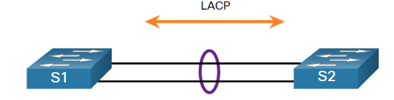

# Agregación de enlaces

El estándar LACP (**Link Aggregation Control Protocol**) permite la agregación de varios enlaces físicos en un único enlace a nivel lógico con el objetivo de mejorar el ancho de banda y la redundancia en la comunicación entre 2 dispositivos de capa 2. La idea es configurar estos puertos para que trabajen simultáneamente repartiéndose la carga, sin que otros protocolos como STP los bloqueen al detectar enlaces redundantes.

## Creación de un EtherChannel entre dos switches



* Configuración switch 1:
```bash
S1(config)# interface range Fa0/1-2
S1(config-if-range)# channel-group 1 mode active
S1(config-if-range)# exit
S1(config)# interface port-channel 1
S1(config-if)# switchport mode trunk
S1(config-if)# switchport trunk allowed 10,20
S1(config-if)# end
```

* Configuración switch 2:
```bash
S1(config)# interface range Fa0/1-2
S1(config-if-range)# channel-group 1 mode passive
S1(config-if-range)# exit
S1(config)# interface port-channel 1
S1(config-if)# switchport mode trunk
S1(config-if)# switchport trunk allowed 10,20
S1(config-if)# end
```
> El extremo en modo activo es el que inicia la negociación del agregado, pero ambos pueden estar en modo activo y el enlace se establecerá igualmente (no pueden estar los 2 en modo pasivo).
> 
> Al aplicar el channel-group a un rango de puertos automáticamente se crea la interfaz port-channel, sobre la que se deberá aplicar toda la configuración del agregado.
> 
> Todos los puertos del agregado deben ser del mismo tipo (Fast o Giga) y estar configurados en el mismo modo dúplex (half, full o auto).
> 
> Todos los puertos del agregado deben tener la misma configuración de VLAN, por ello esta debe aplicarse sobre la interfaz port-channel generada.
> 
> El máximo de puertos a agregar en un mismo EtherChannel es de 8.