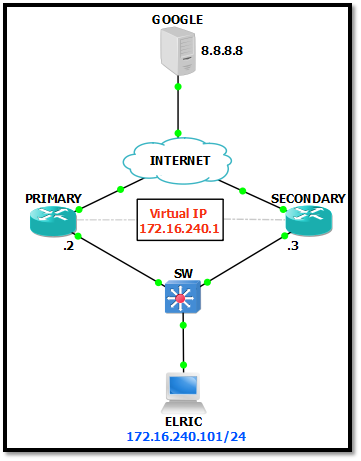
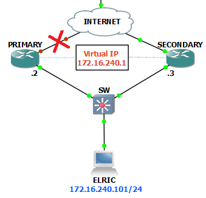

# Redundancia en primer salto

Los protocolos de redundancia de primer salto (FHRP) son mecanismos que proporcionan puertas de enlace predeterminadas alternativas en redes conmutadas donde dos o más enrutadores están conectados a las mismas VLAN.

Una forma de evitar un único punto de fallo en el gateway predeterminado es implementar un **router virtual**. Para implementar este tipo de redundancia de enrutadores, varios enrutadores están configurados para trabajar juntos y presentar la ilusión de un solo enrutador a los hosts en la LAN. Al compartir una dirección IP y una dirección MAC, dos o más routers pueden funcionar como un único router virtual.

* La dirección IPv4 del router virtual se configura como la puerta de enlace predeterminada para las estaciones de trabajo de un segmento específico de IPv4.

* Cuando se envían tramas desde los dispositivos host hacia el gateway predeterminado, los hosts utilizan ARP para resolver la dirección MAC asociada a la dirección IPv4 del gateway predeterminado. 

* La resolución de ARP devuelve la dirección MAC del router virtual. El router actualmente activo dentro del grupo de routers virtuales puede procesar físicamente las tramas que se envían a la dirección MAC del router virtual. 

* Los protocolos se utilizan para identificar dos o más routers como los dispositivos responsables de procesar tramas que se envían a la dirección MAC o IP de un único router virtual. Los dispositivos host envían el tráfico a la dirección del router virtual. El router físico que reenvía este tráfico es transparente para los dispositivos host.

## Protocolo VRRP

**Virtual Router Redundancy Protocol (VRRP)** es el protocolo estándar para redundancia en primer salto.

### Configuración básica de VRRP



* Configuración del router principal:
```bash
Router-ppal#configure terminal
Router-ppal(config)#interface FastEthernet0/0
Router-ppal(config-if)#description LAN
Router-ppal(config-if)#ip address 172.16.240.2 255.255.255.0
Router-ppal(config-if)#vrrp 1 ip 172.16.240.1
Router-ppal(config-if)#vrrp 1 priority 105
Router-ppal(config-if)#vrrp 1 preempt
```
> El comando `vrrp 1 ip 172.16.240.1` establece la IP del router virtual que hará de gateway.
> La prioridad por defecto es 100, por lo que al ponerle 105 este router sería el principal.
> El comando `vrrp 1 preempt` obliga al router de mayor prioridad a convertirse en el activo, en lugar del router activo en ese momento (solo acelera el cambio, es opcional).

* Configuración del router backup:
```bash
Router-bck#configure terminal
Router-bck(config)#interface FastEthernet0/0
Router-bck(config-if)#description LAN
Router-bck(config-if)#ip address 172.16.240.3 255.255.255.0
Router-bck(config-if)#vrrp 1 ip 172.16.240.1
Router-bck(config-if)#vrrp 1 preempt
```
> El backup se quedaría con una prioridad de 100 (menor a la del ppal).

Esta configuración solo nos protegería de posibles fallos del router ppal como reinicios, fallos de alimentación o caída de la conexión LAN (donde hemos configurado el VRRP). En este caso el router backup dejaría de recibir los mensajes de HSRP (keep-alive) que enviaba el router ppal, por lo que el secundario asumiría que algo le pasó, y tomaría el rol de Activo para seguir enrutando el tráfico.

Una vez que el router ppal se haya recuperado, comenzará a mandar nuevamente mensajes de HSRP (keep-alive) diciendo “Oye! Ya estoy aquí de nuevo, tengo una prioridad de 105”, dicha prioridad es mayor que la del router backup, por lo que reclamará de nuevo el rol de Activo y el router bck volverá al rol de Pasivo (Standby).



Sin embargo, en caso de que lo que fallara fuese la conexión hacia el exterior (WAN) del ppal, con la configuración actual, como el ppal no ha dejado de funcionar, va a seguir mandando los mensajes de HSRP keep-alive al router bck, por lo tanto, conservará su rol de Activo al tener mayor prioridad. Esto provoca que HSRP no conmute y todo el tráfico va a seguir llegando al router ppal y, por lo tanto, será descartado, a pesar de que el bck siga teniendo conectividad WAN.

Para solucionar esto existen los llamados **tracks**, que se encargan de monitorizar algún tipo de condición en la red. Podemos configurar VRRP con un track para que si una determinada condición se deja de cumplir, la prioridad del router se decrementa en un valor determinado (el valor por defecto el 10).

* Configuración de track en VRRP para monitorizar el estado de la interfaz WAN:
```bash
Router-ppal#configure terminal
Router-ppal(config)#track 2 interface FastEthernet0/1 line-protocol
Router-ppal(config)#interface FastEthernet0/0
Router-ppal(config-if)#vrrp 1 track 2
```
> Con la opción `line-protocol` el track solo comprueba que la interfaz esté levantada. Si en lugar de esto utilizamos la opción `ip routing`, comprobará también que el enrutado IP esté habilitado y activo en la interfaz.
> Al no indicar un `decrement` específicamente para el track del VRRP, este toma el valor por defecto de 10, que es suficiente para caer hasta una prioridad menor a la del backup.

El problema más común en HSRP es que el fallo no ocurra en el propio router, sino, en el router vecino o incluso uno o dos saltos más adelante.

Entonces, digamos que ya protegiste el router para fallas directas como la caída de la interfaz WAN, pero que pasaría si no se cae la WAN pero algo le pasa al router del otro lado de la WAN o incluso más allá? Esto es algo que se escapa a nuestro control, pero hay una forma de protegerte de este tipo de fallas indirectas.

La manera más fácil es configurar un IP SLA, esta función te permite monitorear algún dispositivo en la red por medio de mensajes como ICMP, por ejemplo y te indica el status de dicho dispositivo.

En este caso, nos sirve para monitorear un dispositivo el cual alcanzamos a través del next-hop por medio de la WAN, puede ser el mismo router que está directamente conectado, o uno o dos más adelante, pero que esten directamente relacionados con la disponibilidad del enlace.

Dicho esto, al usar esta función para monitorear ese dispositivo, el cual de antemano sabemos que si falla, toda la comunicación hacia la WAN sería un “callejón sin salida”, entonces, aquí por medio del status que proporciona el IP SLA, junto con un TRACK, puedes indicarle a HSRP que decremente la prioridad, de tal manera que el router bck lo detecte y tome el rol de Activo en lo que este dispositivo que estás monitoreando se recupere.

* Configuración de un track con SLA a una IP:
``` bash
Router-ppal#configure terminal
Router-ppal(config)#ip sla 1
Router-ppal(config-ip-sla)#icmp-echo 8.8.8.8 source-interface FastEthernet0/1
Router-ppal(config-ip-sla)#timeout 1000
Router-ppal(config-ip-sla)#threshold 2
Router-ppal(config-ip-sla)#frequency 3
Router-ppal(config-ip-sla)#exit
Router-ppal(config)#ip sla schedule 1 life forever start-time now
Router-ppal(config)#track 1 ip sla 1 reachability
Router-ppal(config)#interface FastEthernet0/0
Router-ppal(config-if)#vrrp 1 track 1
```
> El SLA enviará pings a la IP 8.8.8.8 cada 3 segundos (como indica el parámetro `frequency`).
> El parámetro `timeout` indica el tiempo tras el que se da por perdido un ping.
> El parámetro `threshold` indica el número máximo de pings que se pueden perder sin que el SLA lo notifique.
> La configuración de estos 3 parámetros no es necesaria (toma valores por defecto).