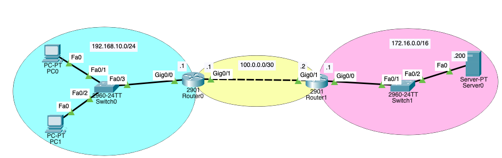

# Traducción de direcciones de red (NAT)

## Tipos de NAT
* **NAT estática** - Asignación uno a uno entre direcciones locales y globales.
Es configurada por el administrador de red y se mantienen constantes.

* **NAT dinámica** - Utiliza un conjunto de direcciones públicas y las asigna según el orden de llegada. Requiere que haya suficientes direcciones públicas para la cantidad total de sesiones de usuario simultáneas.

* **Traducción de la dirección del puerto (PAT)** - Asigna varias direcciones IPv4 privadas a una única dirección IPv4 pública o a unas pocas direcciones. También se conoce como sobrecarga de NAT. Valida que los paquetes entrantes hayan sido solicitados. Utiliza números de puerto para reenviar los paquetes de respuesta al dispositivo interno correcto.

## Configuración de NAT en Cisco

### **Configuración de NAT estática**
1. Crear la asignación entre las direcciones locales internas y locales externas.
```bash
ip nat inside source static ip-local ip-global
```
2. Definir qué interfaces pertenecen a la red interna y cuáles a la red externa.
```bash
interface [tipo] [número]
ip nat inside
interface [tipo] [número]
ip nat outside
```
* Ejemplo de NAT estático:
```bash
Router(config)# ip nat inside source static 192.168.10.2 10.10.10.1
Router(config)# interface g0/1
Router(config-if)# description Intefaz LAN
Router(config-if)# no shutdown
Router(config-if)# ip address 192.168.10.1 255.255.255.0
Router(config-if)# ip nat inside
Router(config-if)# interface g0/0
Router(config-if)# description Interfaz WAN
Router(config-if)# ip address 10.10.10.1
Router(config-if)# ip nat outside
```
> En este caso un host con la IP 192.168.10.2 saldría hacia la WAN identificado por la IP 10.10.10.1

### **Configuración de NAT dinámica**
1. Crear un pool con las direcciones a las que vamos a natear.
```bash
ip nat pool nombre-pool ip-inicial ip-final {netmask máscara-de-red | prefix-length longitud-de-prefijo}
```
2. Crear una ACL estándar para permitir la traducción de esas direcciones.
```bash
ip access-list standard nombre-de-lista-de-acceso
    permit origen [comodín-de-origen]
```
3. Vincular la ACL al pool.
```bash
ip nat inside source list número-de-lista-de-acceso pool nombre-pool
```
4. Identificar las interfaces internas y externas.
```bash
interface [tipo] [número]
ip nat inside
interface [tipo] [número]
ip nat outside
```
* Ejemplo de NAT dinámico:
```bash
Router(config)# ip nat pool POOL1 10.10.10.1 10.10.10.5 netmask 255.255.255.0
Router(config)# ip access-list standard Red_interna
Router(config-std-nacl)# permit 192.168.10.0 0.0.0.255
Router(config-std-nacl)# exit
Router(config)# ip nat inside source list Red_interna pool POOL1
Router(config)# interface g0/1
Router(config-if)# description Intefaz LAN
Router(config-if)# no shutdown
Router(config-if)# ip address 192.168.10.1 255.255.255.0
Router(config-if)# ip nat inside
Router(config-if)# interface g0/0
Router(config-if)# description Interfaz WAN
Router(config-if)# ip address 10.10.10.1
Router(config-if)# ip nat outside
```
> * En este caso los hosts de la red 192.168.10.0/24 saldrían hacia la WAN identificados por una IP del pool 10.10.10.1 ~ 10.10.10.5
> * No se podrán realizar más de 5 traducciones a la vez, pues se establecen correspondencias 1:1
> * Nótese que no es necesario que alguna de esas IPs esté configurada en una interfaz del router, lo importante es que el router anuncie la ruta hacia esas IPs del pool si utiliza enrutado dinámico o bien en el resto de routers se indique que para llegar a las IPs de ese pool deben enviar el tráfico hacia ese router.

### **Configuración de PAT: conjunto de direcciones**
1. Crear un pool con las direcciones a las que vamos a natear.
```bash
ip nat pool name ip-inicial ip-final {netmask máscara-de-red | prefix-length longitud-de-prefijo}
```
2. Crear una ACL estándar para permitir la traducción de esas direcciones.
```bash
ip access-list standard nombre-de-lista-de-acceso
    permit origen [comodín-de-origen]
```
3. Vincular la ACL al pool.
```bash
ip nat inside source list número-de-lista-de-acceso pool nombre overload
```
> La palabra clave **overload** es la que indica que se realice la sobrecarga (PAT).
4. Identificar las interfaces internas y externas.
```bash
interface [tipo] [número]
ip nat inside
interface [tipo] [número]
ip nat outside
```
* Ejemplo de PAT (conjunto de direcciones):
```bash
Router(config)# ip nat pool POOL1 10.10.10.1 10.10.10.5 netmask 255.255.255.0
Router(config)# ip access-list standard Red_interna
Router(config-std-nacl)# permit 192.168.10.0 0.0.0.255
Router(config-std-nacl)# exit
Router(config)# ip nat inside source list Red_interna pool POOL1 overload
Router(config)# interface g0/1
Router(config-if)# description Intefaz LAN
Router(config-if)# no shutdown
Router(config-if)# ip address 192.168.10.1 255.255.255.0
Router(config-if)# ip nat inside
Router(config-if)# interface g0/0
Router(config-if)# description Interfaz WAN
Router(config-if)# ip address 10.10.10.1
Router(config-if)# ip nat outside
```
> * En este caso los hosts de la red 192.168.10.0/24 saldrían hacia la WAN identificados por una IP del pool 10.10.10.1 ~ 10.10.10.5
> * En este caso sí se podrán realizar más de 5 traducciones simultáneas, pues empleamos sobrecarga de puertos.
> * Nótese que no es necesario que alguna de esas IPs esté configurada en una interfaz del router, lo importante es que el router anuncie la ruta hacia esas IPs del pool si utiliza enrutado dinámico o bien en el resto de routers se indique que para llegar a las IPs de ese pool deben enviar el tráfico hacia ese router.


### **Configuración de PAT: dirección única**
1. Definir una ACL estándar para permitir la traducción de esas direcciones.
```bash
ip access-list standard nombre-de-lista-de-acceso
    permit origen [comodín-de-origen]
```
2. Establecer la traducción de origen dinámica, especificar la ACL, la interfaz de salida y la opción de sobrecarga.
```bash
ip nat inside source list número-de-lista-de-acceso interface type nombre overload
```
4. Identificar las interfaces internas y externas.
```bash
interface [tipo] [número]
ip nat inside
interface [tipo] [número]
ip nat outside
```
> Nótese que la interfaz indicada en el comando *ip nat inside* deberá ser la g0/0 en este ejemplo (salida del NAT).

* Ejemplo de PAT (dirección única):
```bash
Router(config)# ip access-list standard Red_interna
Router(config-std-nacl)# permit 192.168.10.0 0.0.0.255
Router(config-std-nacl)# exit
Router(config)# ip nat inside source list Red_interna interface g0/0 overload
Router(config)# interface g0/1
Router(config-if)# description Intefaz LAN
Router(config-if)# no shutdown
Router(config-if)# ip address 192.168.10.1 255.255.255.0
Router(config-if)# ip nat inside
Router(config-if)# interface g0/0
Router(config-if)# description Interfaz WAN
Router(config-if)# ip address 10.10.10.1
Router(config-if)# ip nat outside
```
> En este caso cualquier host de la red 192.168.10.0/24 saldrá por la WAN identificado por la IP 10.10.10.1, haciendo uso de la sobrecarga de puertos.

### **Configuración de reenvío a puerto asignado con IOS**
1. Establecemos correspondencia entre IP-local:puerto-local e IP-global:puerto-global:
```bash
ip nat inside source [static {tcp | udp ip-local puerto-local ip-global puerto-global} [extendable]
```
2. Identificar las interfaces internas y externas.
```bash
interface [tipo] [número]
ip nat inside
interface [tipo] [número]
ip nat outside
```

* Ejemplo -Reenvío de puertos hacia un server 172.16.0.2:8080 accesible desde la 80.0.0.1:80-:
```bash
Router(config)# interface GigabitEthernet0/0
Router(config-if)# ip address 172.16.0.1 255.255.0.0
Router(config-if)# ip nat inside
Router(config-if)# interface GigabitEthernet0/1
Router(config-if)# ip address 80.0.0.1 255.0.0.0
Router(config-if)# ip nat outside
Router(config-if)# exit
Router(config)# ip nat inside source static tcp 172.16.0.2 8080 80.0.0.1 80 
```

## Ejemplo combinado de PAT con múltiples direcciones y reenvío de puertos

> * En este ejemplo queremos que la red privada 192.168.10.0/24 salga hacia afuera nateada por el rango público: 11.11.11.1 ~ 11.11.11.5
> * A su vez, el Router1 deberá hacer un reenvío de puertos de tal modo que el servidor web ubicado en la red privada 172.16.0.0/16 con IP privada 172.16.0.200 sea accesible a través de la IP pública 20.20.20.1

* Configuración del Router0:
```bash
Router0(config)# ip access-list standard Red_interna
Router0(config-std-nacl)# permit 192.168.10.0 0.0.0.255
Router0(config-std-nacl)# exit
Router0(config)# ip nat pool POOL1 11.11.11.1 11.11.11.5 netmask 255.255.255.248
Router0(config)# ip nat inside source list Red_interna pool POOL1 overload
Router0(config)# ip route 20.20.20.1 255.255.255.255 100.0.0.2
Router0(config)# interface GigabitEthernet0/0
Router0(config-if)# ip address 192.168.10.1 255.255.255.0
Router0(config-if)# ip nat inside
Router0(config-if)# interface GigabitEthernet0/1
Router0(config-if)# ip address 100.0.0.1 255.255.255.252
Router0(config-if)# ip nat outside
```
* Configuración del Router1:
```bash
Router1(config)# ip nat inside source static tcp 172.16.0.200 80 20.20.20.1 80
Router1(config)# ip route 11.11.11.0 255.255.255.248 100.0.0.1
Router1(config)# interface GigabitEthernet0/0
Router1(config-if)# ip address 172.16.0.1 255.255.0.0
Router1(config-if)# ip nat inside
Router1(config-if)# interface GigabitEthernet0/1
Router1(config-if)# ip address 100.0.0.2 255.255.255.252
Router1(config-if)# ip nat outside
```
> Nótese que los rangos empleados para natear no están configurados en ninguna interfaz de los routers, simplemente se enrutan.