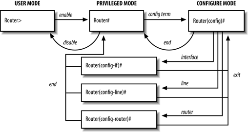

# Cisco

## Modos de navegación en IOS

* **Modo EXEC del usuario** --> Modo de trabajo limitado a operaciones básicas.
* **Modo EXEC privilegiado** --> Permite la ejecución de todos los comandos de control, así como de comandos de configuración y administración.
* **Modos de configuración**:
	* *Global* --> Permite la configuración global del router.
	* *Interfaz* --> Permite la configuración de las interfaces del router.
	* *Router* --> Permite la configuración del enrutado dinámico.
	* *Línea* -->  Permite la configuración de las líneas de conexión al router.




## Acceso remoto

### Configuración de SVI en switch para acceso remoto

Para poder conectarnos de forma remota con un switch, será necesario configurar previamente una SVI de gestión en el switch para acceder a través de una IP asociada a la misma. Necesitamos la gateway si el switch tiene que poder ser administrado desde redes no conectadas directamente. En IPv6 ya coge la gateway automáticamente de los RA.

Si queremos asignarle IPv6 al Switch primero tenemos que activar la doble pila y reiniciarlo (no viene por defecto):

``` bash
! Activar doble pila en Switch
S1(config)# sdm prefer dual-ipv4-and-ipv6 default
S1(config)# end
S1# copy running-config startup-config
S1# reload
```

``` bash
S1# configure terminal
S1(config)# interface vlan 1
S1(config-if)# ip address 172.17.99.11 255.255.255.0
S1(config-if) # ipv6 address 2001:db8:acad:99::1/64
S1(config-if)# no shutdown
S1(config-if)# exit
S1(config)# ip default-gateway 172.17.99.1
S1(config-if)# end
S1# copy running-config startup-config
```

### Acceso vía telnet en router o switch

```bash
! Poner contraseña al modo privilegiado (opcional):
S1(config)# enable secret contraseña123
! Creación usuario local con máximo privilegio:
S1(config)# username usuario1 privilege 15 secret contraseña321
! Configurar línea de consola para acceder con usuarios locales:
S1(config)# line console 0
S1(config-line)#login local
! Configurar líneas de acceso remoto para acceder con usuarios locales por telnet:
S1(config)#line vty 0 15
S1(config-line)#login local
S1(config-line)#transport input telnet
```

En lugar de acceder con un usuario local, podemos simplemente configurar una contraseña para las líneas vty y loguearnos por telnet con ella. En este caso es importante activar el cifrado de contraseñas para que no sean directamente visibles:
```bash
S1(config)# line console 0
S1(config-line)# password contraseña123
S1(config-line)# login
S1(config-line)# exit
S1(config)# service password-encryption
```

### Acceso vía SSH en router o switch

```bash
! Configurar líneas de acceso remoto para acceder con usuarios locales por ssh v2 con clave de 2048 bits:
Router(config)#hostname R1
R1(config)#ip domain-name dominio.com
R1(config)#crypto key generate rsa
R1(config)# 2048
R1(config)#ip ssh version 2
R1(config)#line vty 0 4
R1(config-line)#login local
R1(config-line)#transport input ssh
```
*Antes de habilitar el SSH es necesario definir un hostname, un nombre de dominio y generar un par de claves RSA.


## Servidor DHCP

Ejemplo de configuración de router para asignar IPs de la 192.168.10.10 a la 192.168.10.253 con opciones de gateway y DNS:

```bash
R1(config)# ip dhcp excluded-address 192.168.10.1 192.168.10.9
R1(config)# ip dhcp excluded-address 192.168.10.254 
R1(config)# ip dhcp pool LAN-POOL-1
R1(dhcp-config)# network 192.168.10.0 255.255.255.0
R1(dhcp-config)# default-router 192.168.10.1
R1(dhcp-config)# dns-server 192.168.11.5
R1(dhcp-config)# domain-name example.com
R1(dhcp-config)# end
R1#
```
Configuración de reservas (asociaciones MAC <--> IP automáticas):

```bash
R1(config)# ip dhcp pool RESERVA-1
R1(dhcp-config)# hardware-address 0800.27AC.1234
R1(dhcp-config)# host 192.168.10.254 255.255.255.0
R1(dhcp-config)# end
```

Configurar un router como agente de retransmisión DHCP hacia un servidor (192.168.10.1):
```bash
R1(config)# interface Gi0/0
R1(config-if)# ip helper-address 192.168.10.1
```
*Se debe aplicar esta instrucción en la interfaz de la LAN donde recibirá las peticiones DHCP.

## VLANs

### Creación de VLANs en switch

Al crear una VLAN en un switch solo hay que asignarle un identificador y un nombre.

```bash
S1(config)# vlan 10
S1(config-vlan)# name alumnos
S1(config-vlan)# vlan 20
S1(config-vlan)# name profesores
S1(config-vlan)# end
```
### Asignación de puertos de VLAN

#### Puertos en modo acceso

Un puerto de acceso solo puede tener asignada una VLAN de datos (más la VLAN de voz).

* Configuración de un puerto de acceso con una VLAN de datos:
```bash
S1(config)# interface Fa0/18
S1(config-if)# switchport mode access
S1(config-if)# switchport access vlan 10
S1(config-if)# end
```

* Configuración de un puerto de acceso con una VLAN de datos y una de voz:
```bash
S1(config)# vlan 10
S1(config-vlan)# name alumnos
S1(config-vlan)# vlan 150
S1(config-vlan)# name voz
S1(config)# interface Fa0/18
S1(config-if)# switchport mode access
S1(config-if)# switchport access vlan 10
S1(config-if)# mls qos trust cos
S1(config-if)# switchport voice vlan 10
S1(config-if)# end
```
*El comando `mls qos trust cos` garantiza que el tráfico de voz se identifique como tráfico prioritario.

#### Puertos en modo troncal

En los enlaces troncales se indica la lista de VLANs cuyo tráfico se transporta. Si no se indica con el comando `switchport trunk allowed-vlan vlan vlan-list` y únicamente se activa el modo trunk, por defecto el enlace transportará el tráfico de TODAS las VLANs (sería el equivalente a indicar 'all' en la vlan-list).

Además, todo enlace troncal dispondrá de una VLAN nativa para el envío del tráfico sin etiquetar. Por defecto esta VLAN es la 1, pero se recomienda cambiarla.
```bash
S1(config)# vlan 10
S1(config-vlan)# name alumnos
S1(config)# vlan 20
S1(config-vlan)# name profesores
S1(config)# vlan 30
S1(config-vlan)# name servidores
S1(config-vlan)# vlan 99
S1(config-vlan)# name nativa
S1(config)# interface Fa0/18
S1(config-if)# switchport mode trunk
S1(config-if)# switchport trunk native vlan 99
S1(config-if)# switchport trunk allowed-vlan vlan 10,20,30,99
S1(config-if)# end
```

#### Propogación de configuración de VLANs - VTP

En lugar de crear todas las VLANs en cada switch, existe la posibilidad de crearlas solo en uno, configurarlo como servidor VTP, configurar los demás como clientes y que estos aprendan las VLAN creadas en el servidor.

Configuración del server:

```bash
S1(config)# vtp mode server
S1(config)# vtp domain dominio1
S1(config)# vtp password contraseña123
```

Configuración de clientes:
```bash
S1(config)# vtp mode client
S1(config)# vtp domain dominio1
S1(config)# vtp password contraseña123
```

