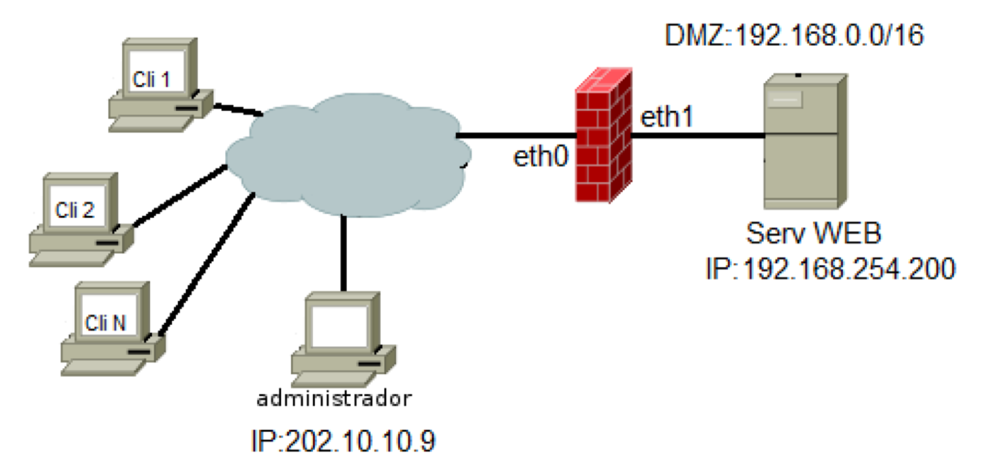

# Solución examen 2021 (Galicia)

## 5.3 Opción B
Nunha organización van instalar un Firewall con Iptables sobre un servidor Debian 10. Este Firewall estará instalado entre unha rede DMZ e Internet, tal como se amosa na seguinte imaxe.

Configure este Firewall para que cumpra coas funcionalidades que se piden a continuación: (Nota: débese controlar o estado das conexións):

a) Débese permitir que o administrador se poida conectar dende a súa casa (IP: 202.10.10.9) ao servizo SSH (porto 22) do Firewall e o servizo SSH do servidor WEB que está na DMZ.

```shell
iptables -P OUTPUT DROP
iptables -P INPUT DROP
iptables -P FORWARD DROP
iptables -A OUTPUT -m state --state RELATED,ESTABLISHED -j ACCEPT
iptables -A INPUT -m state --state RELATED,ESTABLISHED -j ACCEPT
iptables -A FORWARD -m state --state RELATED,ESTABLISHED -j ACCEPT
iptables -A INPUT -s 202.10.10.9 -p tcp --dport 22 -m state --state NEW -j ACCEPT
iptables -t nat -A PREROUTING -p tcp -dport 22 -s 202.10.10.9 -j DNAT --to-destination 192.168.254.200:22
iptables -A FORWARD -s 202.10.10.9 -d 192.168.254.200 -i eth0 -o eth1 -p tcp --dport 22 -m state --state NEW -j ACCEPT
```
b) Os clientes de Internet poderanse conectar ao servidor WEB.
```shell
iptables -A INPUT -m state --state RELATED,ESTABLISHED -j ACCEPT
iptables -A FORWARD -m state --state RELATED,ESTABLISHED -j ACCEPT
iptables -t nat -A PREROUTING -p tcp -i eth0 -m multiport -dports 80,443 -j DNAT --to-destination 192.168.254.200
iptables -A FORWARD -d 192.168.254.200 -i eth0 -o eth1 -p tcp -m multiport -dports 80,443 -m state --state NEW -j ACCEPT
```
c) Débese pór un límite de 25 conexións por segundo aos portos 80 e 443 dende Internet.
```shell
#Podría ser: mangle va antes de nat
iptables -t mangle -A PREROUTING -p tcp -i eth0 -m multiport -dports 80,443 -m limit --limit 25/s -j DROP
```
d) Rexistrarase (facer log) calquera intento de conexión que non estea permitido e débese engadir o texto “ConxProh:” ao rexistro. (Nota: o servidor de logs é o que está instalado por defecto en Debian 10: syslog).
```shell
iptables -A INPUT -i eth0 -j LOG --log-prefix "ConxProh: " --log-level 4
```
e) Débense eliminar tódolos paquetes de información que chegan pola tarxeta eth0 (dende Internet) e que teñan tódolos bits da cabeceira TCP igual a 0.
```shell
iptables -t mangle -A PREROUTING -i eth0 -p tcp -–tcp-flags ALL NONE -j DROP
```

## 5 Opción A

Configure este Firewall para que cumpra coas funcionalidades que se piden a continuación (Nota: débese controlar o estado das conexións):

a) Os ordenadores da LAN deben poder comunicarse cos servidores WEB en Internet.
```bash
iptables -A FORWARD -m state  --state RELATED,ESTABLISHED -j ACCEPT
iptables -A FORWARD -s 192.168.0.0/16 -i eth1 -o eth0 -p tcp -m multiport --dports 80,443 -m state --state NEW -j ACCEPT
```

b) O servidor DNS que está na LAN deberá poder conectarse, a través do Firewall, ao seu DNS forwarder
que está en Internet, coa IP: 208.67.222.222.
```bash
iptables -A FORWARD -m state --state RELATED,ESTABLISHED -j ACCEPT
```

c) Realice a configuración necesaria para que o ordenador do administrador na LAN (192.168.0.23)
poida establecer comunicación co servizo SSH instalado no Firewall.
```bash
iptables -A OUTPUT -m state --state RELATED,ESTABLISHED -j ACCEPT
iptables -A INPUT -s 192.168.0.23  -p tcp --dport 22 -m state --state NEW -j ACCEPT
```

d) Débense eliminar tódolos paquetes de información que entran pola tarxeta eth0 (dende Internet) e
cuxos bits SYN e FIN da cabeceira TCP sexan igual a 1 e o resto de bits iguais a 0.
```shell
iptables -t mangle -A PREROUTING -i eth0 -p tcp -–tcp-flags ALL SYN,FIN -j DROP
```

e) Débese rexistrar (facer un log) cando algún ordenador da LAN, distinto do ordenador do administrador, intente conectarse ao porto ssh (22) do Firewall. Débese engadir o texto “SSH-Proh: ” ao rexistro. (Nota: o servidor de logs é o que está instalado por defecto en Debian 10: syslog).
``` shell
iptables -N SSH
iptables -A INPUT -s 192.168.0.0/16 -p tcp --dport 22 -m state --state NEW -j SSH
iptables -A SSH -s 192.168.0.23 -j ACCEPT
iptables -A SSH -j LOG --log-prefix "SSH-Proh: " --log-level 4
iptables -A SSH -j DROP
```

f) Non se permitirá máis dun paquete icmp echo-request (ping) por segundo dende a LAN cara o Firewall e ningún ping desde Internet cara o Firewall.
``` shell
iptables -A INPUT -i eth1 -p icmp --icmp-type echo-request -m limit --limit 1/s -j ACCEPT
iptables -A INPUT -i eth0 -p icmp --icmp-type echo-request -j REJECT
```