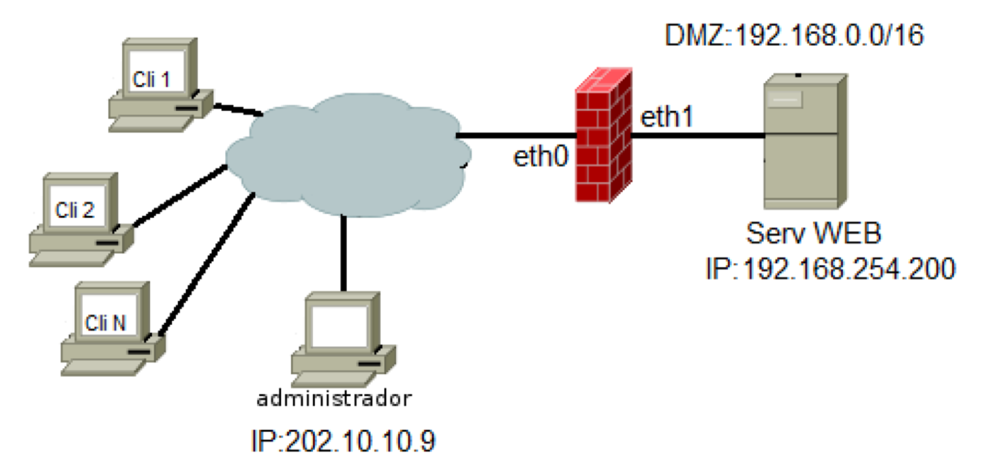

#Solución ejercicio 5.3 2021 (Galicia)
Nunha organización van instalar un Firewall con Iptables sobre un servidor Debian 10. Este Firewall estará instalado entre unha rede DMZ e Internet, tal como se amosa na seguinte imaxe.

Configure este Firewall para que cumpra coas funcionalidades que se piden a continuación: (Nota: débese controlar o estado das conexións):

a) Débese permitir que o administrador se poida conectar dende a súa casa (IP: 202.10.10.9) ao servizo SSH (porto 22) do Firewall e o servizo SSH do servidor WEB que está na DMZ.

```shell

#--- GENERAL -----
iptables -P OUTPUT DROP
iptables -P INPUT DROP
iptables -P FORWARD DROP
iptables -A OUTPUT --state RELATED,ESTABLISHED -j ACCEPT
iptables -A INPUT --state RELATED,ESTABLISHED -j ACCEPT
iptables -A FORWARD --state RELATED,ESTABLISHED -j ACCEPT

# SSH firewall 
iptables -A INPUT -s 202.10.10.9 -p tcp --dport 22 --state NEW -j ACCEPT
iptables -t nat -A POSTROUTING -p tcp -i eth0 -dport 22 -s 202.10.10.9 -j SNAT --to-source 192.168.254.200:22

```
b) Os clientes de Internet poderanse conectar ao servidor WEB.
```shell

iptables -t nat -A PREROUTING -p tcp -i eth0 -m multiport -dports 80,443 -j DNAT --to-destination 192.168.254.200

```
c) Débese pór un límite de 25 conexións por segundo aos portos 80 e 443 dende Internet.
```shell
iptables -A INPUT -p tcp --syn -m multiport --dports 80,443 -m limit --limit 25/s -j DROP
```
d) Rexistrarase (facer log) calquera intento de conexión que non estea permitido e débese engadir o texto “ConxProh:” ao rexistro. (Nota: o servidor de logs é o que está instalado por defecto en Debian 10: syslog)
```shell
iptables -A INPUT -i eth0 --state NEW -j LOG --log-prefix "ConxProh: "
```
e) Débense eliminar tódolos paquetes de información que chegan pola tarxeta eth0 (dende Internet) e que teñan tódolos bits da cabeceira TCP igual a 0.
```shell
iptables -A INPUT -p tcp –tcp-flags ALL NONE -j DROP
```
