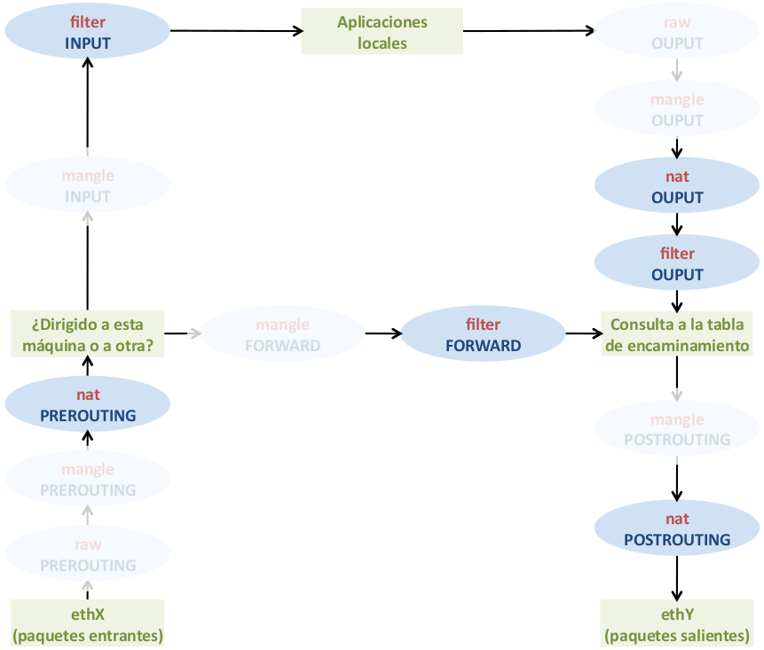

#Configuración básica de Netfilter/IPTABLES
||
|:--:|
|**Imagen 1:** Tablas y cadenas predeterminadas más utilizadas en netfilter|
##Configuración básica
###Politicas por defecto
```bash title="Denegar por defecto (CleanUp Rules)"
iptables -P INPUT DROP
iptables -P OUTPUT DROP
iptables -P FORWARD DROP
```
###Reglas estáticas
No guardan el estado de las conexiones
```bash title="Salida"
iptables -A OUTPUT -p udp --dport 53 -d 8.8.8.8 -j ACCEPT
iptables -A OUTPUT -p udp --dport 53 -d 8.8.4.4 -j ACCEPT
```
```bash title="Entrada"
iptables -A INPUT -p udp --sport 53 -s 8.8.8.8 -j ACCEPT
iptables -A INPUT -p udp --sport 53 -s 8.8.4.4 -j ACCEPT
```
```bash title="Varios puertos al mismo tiempo"
iptables -A OUTPUT -p tcp -m multiport --dports 80,443 -j ACCEPT
iptables -A INPUT -p tcp -m multiport --sports 80,443 -j ACCEPT
```
###Reglas con estados persistentes
```bash title="Persistentes"
iptables -A INPUT -m state --state ESTABLISHED,RELATED -j ACCEPT
iptables -A OUTPUT -m state --state ESTABLISHED,RELATED -j ACCEPT

iptables -A OUTPUT -p udp --dport 53 -d 8.8.8.8 -m state --state NEW -j ACCEPT
iptables -A OUTPUT -p tcp -m multiport --dports 80,443 -m state --state NEW -j ACCEPT

iptables -A INPUT -p tcp --dport 22 -m state --state NEW -j ACCEPT
```
##SNAT (Source Network Address Translation)
En netfilter, **SNAT o Masquerade** se realizan en la cadea **POSTROUTING** y permite especificar:

1. La Dirección IP origen que debe ponerse
2. Indicar el puerto/s

- La IP de origen de los paquetes procedentes de los equipos de la red 192.168.1.0/24 será reemprazada por 79.0.0.1 
```bash 
iptables -t nat -A POSTROUTING -s 192.168.1.0/24 -j SNAT --to-source 79.0.0.1
```
- La IP de origen de los paquetes procedentes de los equipos de la red 192.168.1.0/24 será reemprazada por la IP pública del router
```bash hl_lines="1"
iptables -t nat -A POSTROUTING -s 192.168.1.0/24 -j MASQUERADE
```
- La IP de origen de los paquetes procedentes de equipos de la red 192.168.1.0/24 será reemprazada por 79.0.0.1 y el puerto de origen tcp/udp se cambiara por uno de rango 100-1100
```bash
iptables -t nat -A POSTROUTING -s 192.168.1.0/24 -j SNAT --to-source 79.0.0.1:100-1100
```
- La IP de origen de los paquetes procedentes de los equipos de la red 192.168.1.0/24 será reemprazada por una IP del rango 79.0.0.1-79.0.0.6
```bash
iptables -t nat -A POSTROUTING -s 192.168.1.0/24 -j SNAT --to-source 79.0.0.1-79.0.0.6
```
- La IP de origen de los paquetes procedentes de los equipos de la red 192.168.1.0/24 será reemprazada por una IP del rango 79.0.0.1-79.0.0.6 y 80.0.0.1
```bash 
iptables -t nat -A POSTROUTING -s 192.168.1.0/24 -j SNAT --to-source 79.0.0.1-79.0.0.6 --to-source 80.0.0.1
```
- Con SAME se consigue SNAT pero además se usara siempre la misma IP pública con la misma IP privada.
```bash 
iptables -t nat -A POSTROUTING -s 192.168.1.0/24 -j SAME --to 79.0.0.1-79.0.0.6
```
## DNAT (Destination Network Address Translation)
En netfilter, **DNAT** se realiza en las cadenas **PREROUTING** y OUTPUT
- La IP de destino de los paquetes destinados a 79.0.0.1 será reemprazada por 192.168.1.1
```bash
iptables -t nat -A PREROUTING -d 79.0.0.1 -j DNAT --to-destination 192.168.1.1
```
- La IP de destino de los paquetes tcp destinados a 79.0.0.1 porto 80 será reemprazada por 192.168.1.1
```bash
iptables -t nat -A PREROUTING -d 79.0.0.1 -p tcp --dport 80 -j DNAT --to-destination 192.168.1.1
```
- La IP de destino de los paquetes tcp destinados a 79.0.0.1 y a calquiera de los puertos 22, 80 ó 443 será reemprazada por 192.168.1.1
```bash
iptables -t nat -A PREROUTING -d 79.0.0.1 -p tcp -m multiport --dports 22,80,443 -j DNAT --to-destination 192.168.1.1
```
- Los paquetes tcp destinados a 79.0.0.1 puerto 22000 serán transformados para tener IP de destino 192.168.1.1 y puerto destino tcp/22
```bash
iptables -t nat -A PREROUTING -d 79.0.0.1 -p tcp --dport 22000 -j DNAT --to-destination 192.168.1.1:22
```
- Los paquetes tcp con origen el equipo 80.0.0.1 y destino 79.0.0.1 puerto 22000 serán transformados para tener IP destino 192.168.1.1 y porto destino tcp/22
```bash
iptables -t nat -A PREROUTING -s 80.0.0.1 -d 79.0.0.1 -p tcp --dport 22000 -j DNAT --to-destination 192.168.1.1:22
```
## FULL NAT
IP pública mapeada a IP privada
```bash
iptables -t nat -A PREROUTING -s 192.168.1.0/24 -j NETMAP --to 79.0.0.0/24
```